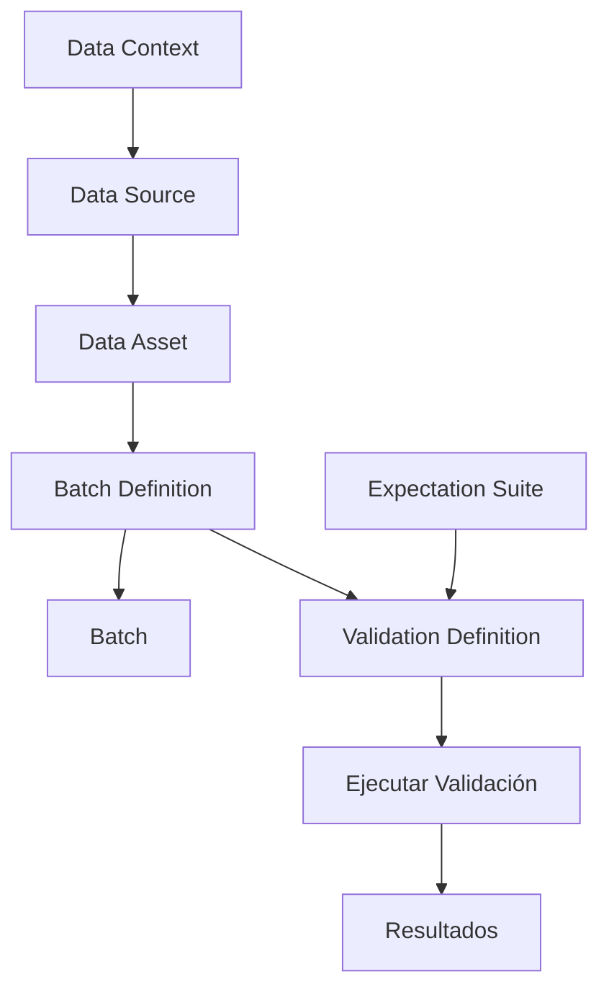

# Apuntes de Great Expectations: Creación y Validación de Expectativas

## 1. Introducción a las Expectativas

En Great Expectations, una **Expectation** (expectativa) es una afirmación verificable y comprobable sobre los datos. Es el bloque fundamental para definir y validar la calidad de los datos. Las expectativas permiten responder preguntas como:

- ¿El dataset tiene el número esperado de filas?
- ¿Hay valores nulos en columnas críticas?
- ¿Los valores de una columna están dentro de un rango aceptable?
- ¿Las columnas esperadas están presentes?

Cada expectativa es una aserción que puede ser **verdadera** o **falsa** cuando se evalúa contra un conjunto de datos real.

---

## 2. El Dataset de Ejemplo: Generación de Energía Renovable

Para ilustrar los conceptos, utilizaremos un dataset de generación de energía renovable con las siguientes características:

- **118,066 filas** y **17 columnas**.
- Columnas principales: `Time`, `Energy delta[Wh]`, `GHI`, `temp`, `pressure`, `humidity`, `wind_speed`, `rain_1h`, `snow_1h`, `clouds_all`, entre otras.

Este dataset servirá como base para crear y probar expectativas.

---

## 3. Creación y Validación de Expectativas Individuales

### 3.1. Estructura básica

Para crear una expectativa, se utiliza la clase `gx.expectations.Expect...` correspondiente al tipo de validación deseada. Luego, se valida contra un **Batch** usando el método `batch.validate()`.

```python
expectation = gx.expectations.ExpectTableRowCountToEqual(value=118000)
validation_results = batch.validate(expect=expectation)
```

### 3.2. Evaluación de resultados

El objeto `validation_results` contiene información detallada sobre la validación:

```python
print(validation_results.describe())
```

**Salida típica:**
```json
{
  "expectation_type": "expect_table_row_count_to_equal",
  "success": false,
  "kwargs": {
    "batch_id": "my_pandas_datasource-my_dataframe_asset",
    "value": 118000
  },
  "result": {
    "observed_value": 118066
  }
}
```

- **`success`**: Booleano que indica si la expectativa se cumplió.
- **`result["observed_value"]`**: Valor real observado en los datos.
- **`kwargs`**: Parámetros con los que se creó la expectativa.

### 3.3. Acceso directo a propiedades

```python
print(validation_results.success)      # False
print(validation_results.result)       # {'observed_value': 118066}
```

---

## 4. Tipos Comunes de Expectativas

### 4.1. Expectativas de forma (Shape Expectations)

Validan características generales del dataset.

| Expectativa | Descripción |
| :--- | :--- |
| **`ExpectTableRowCountToEqual(value)`** | El número de filas debe ser exactamente `value`. |
| **`ExpectTableRowCountToBeBetween(min_value, max_value)`** | El número de filas debe estar entre `min_value` y `max_value` (inclusive). |
| **`ExpectTableColumnCountToEqual(value)`** | El número de columnas debe ser exactamente `value`. |
| **`ExpectTableColumnCountToBeBetween(min_value, max_value)`** | El número de columnas debe estar entre `min_value` y `max_value`. |

**Ejemplo con rango de filas:**
```python
row_count_expectation = gx.expectations.ExpectTableRowCountToBeBetween(
    min_value=117000, max_value=119000
)
validation_results = batch.validate(expect=row_count_expectation)
print(validation_results.success)  # True (118066 está dentro del rango)
```

**Ejemplo con conteo de columnas:**
```python
# Esperamos exactamente 15 columnas, pero el dataset tiene 18
col_count_expectation = gx.expectations.ExpectTableColumnCountToEqual(value=15)
validation_results = batch.validate(expect=col_count_expectation)
print(validation_results.success)  # False
print(validation_results.result)   # {'observed_value': 18}

# Usando rango
col_count_expectation = gx.expectations.ExpectTableColumnCountToBeBetween(
    min_value=14, max_value=18
)
validation_results = batch.validate(expect=col_count_expectation)
print(validation_results.success)  # True
```

### 4.2. Expectativas de nombres de columnas (Column Name Expectations)

Validan la presencia y el conjunto de columnas.

| Expectativa | Descripción |
| :--- | :--- |
| **`ExpectTableColumnsToMatchSet(column_set)`** | El conjunto de columnas debe coincidir exactamente con `column_set` (un set de nombres). |
| **`ExpectColumnToExist(column)`** | Una columna específica debe existir en el dataset. |

**Ejemplo de coincidencia de conjunto:**
```python
expected_cols = [
    'clouds_all', 'snow_1h', 'rain_1h', 'wind_speed', 
    'humidity', 'pressure', 'temp', 'GHI', 
    'Energy delta[Wh]', 'Time'
]

col_names_expectation = gx.expectations.ExpectTableColumnsToMatchSet(
    column_set=set(expected_cols)
)
validation_results = batch.validate(expect=col_names_expectation)
print(validation_results.success)  # True
print(validation_results.result)   # Muestra las columnas observadas
```

**Ejemplo de verificación de columna individual:**
```python
# Columna que no existe
expectation = gx.expectations.ExpectColumnToExist(column="not_a_column")
validation_results = batch.validate(expect=expectation)
print(validation_results.success)  # False

# Columna existente
expectation = gx.expectations.ExpectColumnToExist(column="GHI")
validation_results = batch.validate(expect=expectation)
print(validation_results.success)  # True
```

---

## 5. Suites de Expectativas (Expectation Suites)

Una **Expectation Suite** es un grupo de expectativas que describen el mismo conjunto de datos. Permite organizar y reutilizar múltiples validaciones juntas.

### 5.1. Creación de una Suite

```python
suite = gx.ExpectationSuite(name="my_suite")
print(suite)
```

### 5.2. Adición de expectativas a la Suite

Se añaden expectativas una a una con el método `.add_expectation()`:

```python
expectation1 = gx.expectations.ExpectTableRowCountToEqual(value=118000)
suite.add_expectation(expectation=expectation1)

expectation2 = gx.expectations.ExpectTableColumnCountToEqual(value=17)
suite.add_expectation(expectation=expectation2)
```

### 5.3. Visualización de la Suite

Para ver todas las expectativas en la suite:

```python
print(suite.expectations)
# o
print(suite["expectations"])
```

**Salida (abreviada):**
```json
[
  ExpectTableRowCountToEqual(id='...', value=118000, ...),
  ExpectTableColumnCountToEqual(id='...', value=17, ...)
]
```

También se pueden consultar metadatos:

```python
print(suite.name)        # "my_suite"
print(suite.meta)        # {"great_expectations_version": "1.2.4"}
print(suite.id)          # UUID de la suite
print(suite.notes)       # None (campo para notas)
```

### 5.4. Validación de una Suite

Se valida una suite de la misma manera que una expectativa individual, pasando la suite al parámetro `expect`:

```python
validation_results = batch.validate(expect=suite)
print(validation_results.success)        # False (si alguna falla)
print(validation_results.describe())      # Resumen detallado
```

**Ejemplo de salida de `describe()`:**
```json
{
  "success": false,
  "statistics": {
    "evaluated_expectations": 2,
    "successful_expectations": 1,
    "unsuccessful_expectations": 1,
    "success_percent": 50.0
  },
  "expectations": [
    {
      "expectation_type": "expect_table_row_count_to_equal",
      "success": false,
      "kwargs": {"value": 118000},
      "result": {"observed_value": 118066}
    },
    {
      "expectation_type": "expect_table_column_count_to_equal",
      "success": true,
      "kwargs": {"value": 17},
      "result": {"observed_value": 17}
    }
  ]
}
```

---

## 6. Definiciones de Validación (Validation Definitions)

Una **Validation Definition** es un objeto que vincula una Expectation Suite con los datos que describe (a través de un Batch Definition). Permite ejecutar validaciones de manera más estructurada y reutilizable.

### 6.1. Creación de una Validation Definition

```python
validation_definition = gx.ValidationDefinition(
    name="my_validation_definition",
    data=batch_definition,   # El Batch Definition creado previamente
    suite=suite               # La Expectation Suite
)

print(validation_definition)
```

### 6.2. Visualización de una Validation Definition

Se pueden inspeccionar sus componentes:

```python
print(validation_definition.name)          # "my_validation_definition"
print(validation_definition.suite)         # La suite asociada
print(validation_definition.data)          # El Batch Definition
print(validation_definition.id)            # UUID (None si no se ha guardado)
print(validation_definition.data_source)   # Detalles de la fuente de datos
```

### 6.3. Ejecución de una Validation Definition

Para ejecutar la validación, se usa el método `.run()` pasando los parámetros del batch (en este caso, el DataFrame):

```python
validation_results = validation_definition.run(
    batch_parameters={"dataframe": dataframe}
)
```

### 6.4. Error común: Suite no añadida al Data Context

Si la Expectation Suite no ha sido añadida al Data Context, al ejecutar la Validation Definition se producirá un error:

```
ValidationDefinitionRelatedResourcesFreshnessError:
ExpectationSuite 'my_suite' must be added to the DataContext before it can be updated.
Please call 'context.suites.add(<SUITE_OBJECT>)', then try your action again.
```

**Solución:** Añadir la suite al contexto antes de usarla en una Validation Definition.

```python
suite = context.suites.add(suite=suite)
```

### 6.5. Resultados de la validación

Una vez corregido el error, se ejecuta la validación y se examinan los resultados:

```python
validation_results = validation_definition.run(
    batch_parameters={"dataframe": dataframe}
)
print(validation_results.success)
print(validation_results.describe())
```

La salida de `describe()` es similar a la de una suite, pero ahora vinculada a la Validation Definition y opcionalmente a GX Cloud (si está configurado), con un `result_url` para ver los resultados en la web.

---

## 7. Nota sobre la flexibilidad de Great Expectations

Great Expectations ofrece **múltiples flujos de trabajo** para tareas similares. Por ejemplo, existen diferentes formas de crear y gestionar Batch Definitions y Validation Definitions. Este curso proporciona una base sólida, pero en implementaciones reales pueden encontrarse enfoques alternativos dependiendo de la versión y la configuración.

---

## 8. Cheat Sheet Resumen

### Expectativas individuales

```python
# Crear expectativa
expectation = gx.expectations.ExpectTableRowCountToEqual(value=118000)

# Validar contra batch
validation_results = batch.validate(expect=expectation)

# Inspeccionar resultados
print(validation_results.success)
print(validation_results.result)
print(validation_results.describe())
```

### Expectativas de forma y esquema

| Tipo | Ejemplo |
| :--- | :--- |
| Número de filas | `ExpectTableRowCountToEqual(value)` |
| Rango de filas | `ExpectTableRowCountToBeBetween(min, max)` |
| Número de columnas | `ExpectTableColumnCountToEqual(value)` |
| Rango de columnas | `ExpectTableColumnCountToBeBetween(min, max)` |
| Conjunto de columnas | `ExpectTableColumnsToMatchSet(column_set)` |
| Columna existe | `ExpectColumnToExist(column)` |

### Suites de expectativas

```python
# Crear suite
suite = gx.ExpectationSuite(name="mi_suite")

# Añadir expectativas
suite.add_expectation(expectation=expectation1)
suite.add_expectation(expectation=expectation2)

# Validar suite
validation_results = batch.validate(expect=suite)

# Ver resultados
print(validation_results.success)
print(validation_results.describe())
```

### Validation Definitions

```python
# Añadir suite al contexto (requerido antes de crear ValidationDefinition)
suite = context.suites.add(suite=suite)

# Crear Validation Definition
validation_definition = gx.ValidationDefinition(
    name="mi_validacion",
    data=batch_definition,
    suite=suite
)

# Ejecutar validación
validation_results = validation_definition.run(
    batch_parameters={"dataframe": dataframe}
)

# Ver resultados
print(validation_results.success)
print(validation_results.describe())
```

---

## 9. Flujo de trabajo completo



1. Configurar **Data Context**.
2. Crear **Data Source** y **Data Asset**.
3. Definir **Batch Definition**.
4. Obtener un **Batch**.
5. Crear **Expectations** y agruparlas en una **Suite**.
6. (Opcional) Crear una **Validation Definition** vinculando Suite y Batch Definition.
7. Ejecutar la validación (directamente sobre el Batch o mediante la Validation Definition).
8. Analizar los **resultados**.

